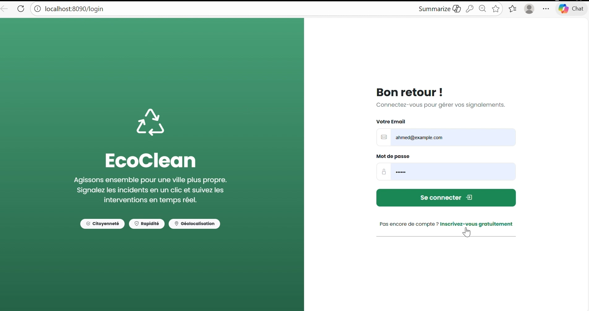
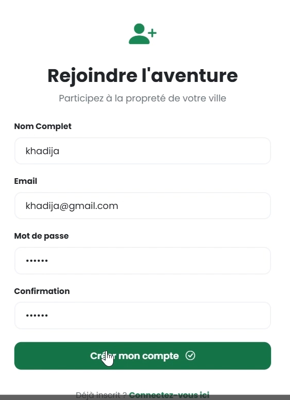
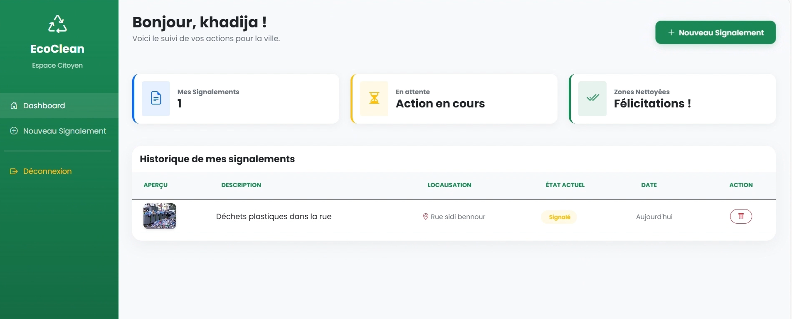
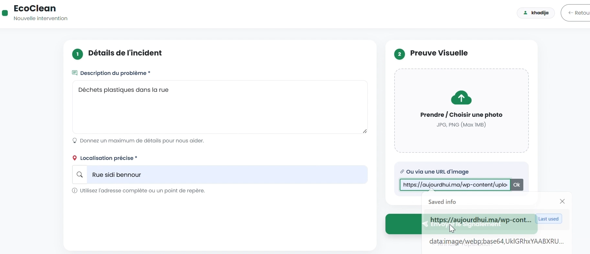
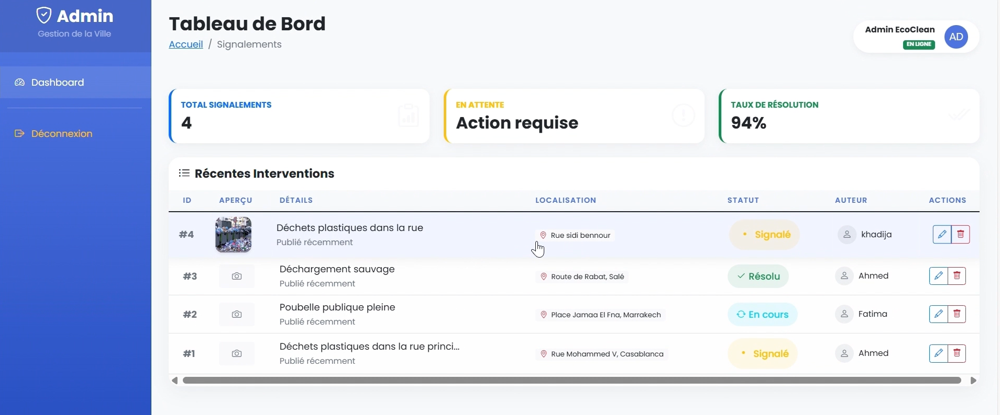

# 🌱 EcoClean — Plateforme de Signalement Urbain Intelligente

Application web intelligente permettant aux citoyens de signaler les incidents urbains (déchets, pollution, anomalies de voirie…) et de suivre leur traitement en temps réel.

---

## 📸 Aperçu de l’application

### 🔐 Page de connexion



---

### 📊 Dashboard Citoyen



---

### 📝 Création d’un signalement



---

## 🚀 Fonctionnalités

- ✅ Authentification sécurisée avec JWT
- ✅ Gestion des rôles (Admin / Citoyen)
- ✅ Création et suivi des signalements
- ✅ Upload d’images ou ajout via URL
- ✅ Dashboard interactif
- ✅ Interface responsive avec Thymeleaf
- ✅ API REST sécurisée avec Spring Security
- ✅ Gestion des interventions urbaines

---

## 🛠️ Stack Technique

### Backend
- Java 17
- Spring Boot
- Spring Security
- JWT Authentication
- Spring Data JPA
- Hibernate

### Frontend
- Thymeleaf
- HTML5 / CSS3
- Bootstrap

### Base de données
- MySQL

---

## 🗄️ Architecture de la Base de Données

### Principales entités

- **User**
  - id
  - username
  - email
  - password
  - role

- **Signalement**
  - id
  - description
  - localisation
  - imageUrl
  - status
  - createdAt

- **Role**
  - ADMIN
  - CITOYEN

---

## 🔒 Sécurité

Le système utilise :

- JWT Authentication
- Spring Security
- Protection des routes
- Gestion des autorisations par rôle
- BCrypt Password Encoder

---

## 📡 API REST

### Exemples d’endpoints

```http
POST /api/auth/login
POST /api/auth/register
GET  /api/signalements
POST /api/signalements
PUT  /api/signalements/{id}
DELETE /api/signalements/{id}
